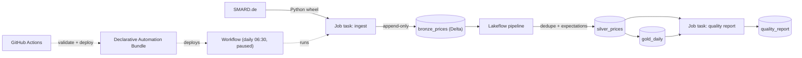

# databricks-energy-quality

[](https://github.com/kaeldrin-gh/databricks-energy-quality/actions/workflows/ci.yml)
[](LICENSE)

A managed-lakehouse data-engineering project on **Databricks Free Edition**:
German day-ahead prices land in Delta, are deduplicated by a Lakeflow pipeline
with quality expectations, and are monitored by a daily workflow that writes a
quality report and fails when the data stops being trustworthy.

Companion projects:
[de-energy-streaming](https://github.com/kaeldrin-gh/de-energy-streaming)
(self-hosted streaming lakehouse) and
[nl-energy-warehouse](https://github.com/kaeldrin-gh/nl-energy-warehouse)
(dbt analytics engineering).

## Why this project exists

The other two repositories prove streaming and analytics engineering on a
local, self-hosted stack. This one is deliberately different: it shows the
**managed-platform** side of the job - Unity Catalog, Delta, lakeflow
pipelines, workflows, bundles and CI/CD - on a workspace that costs nothing.

Databricks Free Edition is free and keyless-for-the-user (no credit card), but
constrained, and the project is built around those constraints on purpose:
serverless compute only, quota limits, one workspace, and a single schedule
that ships **paused** so nothing runs up a bill that cannot exist.

## Architecture



One Unity Catalog schema, three Delta tables plus the report:

- **bronze_prices** - append-only landing of published SMARD hours
- **silver_prices** - one row per `(region, delivery_ts)`; the newest
  `fetched_at` wins, enforced in the pipeline
- **gold_daily** - hours, average/min/max price and negative hours per day
- **quality_report** - every check run, appended so history is queryable

## What it demonstrates

| Capability | Where |
| --- | --- |
| Unity Catalog | `catalog.schema.table` naming, variables in the bundle |
| Delta Lake | append landing, dedupe, aggregates, report history |
| Lakeflow Spark Declarative Pipelines | `src/notebooks/pipeline.py` with expectations |
| Workflows / Jobs | three tasks with dependencies, retry-friendly schedule |
| Declarative Automation Bundles | `databricks.yml` + `resources/`, wheel artifact |
| CI/CD | GitHub Actions: tests always, bundle validate + deploy when a token exists |
| Data-quality monitoring | freshness, bounds, uniqueness and DST-aware day checks |
| Cost awareness | serverless-only config, paused schedule, tiny quota-friendly jobs |

## Free Edition constraints this respects

- **Serverless only** - no cluster configuration anywhere; the pipeline sets
  `serverless: true`.
- **Quota-limited** - one source, three tables, one short daily job; the
  schedule ships paused and `mode: development` keeps resource names prefixed.
- **No account-level APIs** - the bundle uses workspace-level resources only.
- **Outbound internet after LinkedIn verification** - required for the SMARD
  fetch from the workspace.
- **Personal, non-commercial use** - this is an openly documented prototype.

## The daily job

1. **ingest** - the wheel's SMARD client fetches the recent weekly chunks and
   appends the published hours to `bronze_prices`.
2. **transform** - the Lakeflow pipeline deduplicates bronze (newest revision
   per hour), drops rows missing keys or prices, and builds `gold_daily`.
3. **quality** - freshness (26 h SLA), price bounds (-500..1000 EUR/MWh),
   silver uniqueness and daily hour counts (23/24/25, DST-aware; the first and
   last day of the rolling window are partial by construction and skipped) are
   checked, appended to `quality_report`, and any failure fails the task.

The checks live in `src/energy_quality/quality.py` as pure functions, so they
are unit-tested without a workspace - the same pattern the other two
repositories use for their correctness rules.

## Quickstart (local)

```bash
python -m venv .venv
.venv\Scripts\activate        # Windows; use source .venv/bin/activate elsewhere
pip install -e ".[dev]"

python -m pytest -q           # unit tests, no workspace or network
ruff check . && ruff format --check .
```

## Deploy to your Free Edition workspace

```bash
winget install Databricks.DatabricksCLI    # or brew, or the install script
databricks auth login --host https://<your-workspace>.cloud.databricks.com

pip install build
databricks bundle validate -t free
databricks bundle deploy -t free
databricks bundle run -t free energy_quality_job    # runs the job once
```

Find your catalog name with `SHOW CATALOGS` in the SQL editor and pass it to
the bundle if it is not `workspace`:

```bash
databricks bundle deploy -t free --var="catalog=<your-catalog>"
```

To let CI deploy for you, create a workspace token (Settings -> Developer ->
Access tokens) and add the repository secrets `DATABRICKS_HOST` and
`DATABRICKS_TOKEN`. The workflow masks the workspace user path in its logs, so
the public Actions tab stays free of personal details. Without the secrets, CI
stays green and skips validation and deploy with a notice.

## Dashboard

`sql/quality_queries.sql` has the queries behind the dashboard: latest check
results, check history, freshness in hours, 30-day prices and the uniqueness
invariant. Create them in the SQL editor and pin them to a dashboard.

## Honesty notes

- This is a **prototype on Databricks Free Edition** (personal use), not a
  production deployment; the free tier has no SLA and pauses compute when
  quotas are exceeded.
- The workspace is private, so there is no public live link - reviewers can
  sign up for Free Edition (free) and deploy the bundle themselves.
- First deploys on a fresh workspace can surface serverless-specific tweaks,
  and the bundle now encodes the three this repository hit: serverless job
  tasks reject task-level `libraries` (the wheel belongs in the job
  environment), that environment requires an `environment_version`, and paths
  in `environments[].spec.dependencies` resolve relative to the resource file
  (`../dist/*.whl`), not the bundle root.

## Layout

```
databricks.yml                       bundle definition (variables, wheel, target)
resources/                           pipeline and job resources
src/energy_quality/                  package: SMARD client, quality checks, tasks
src/notebooks/                       Databricks notebooks (ingest, pipeline, report)
tests/                               unit tests for parsers and quality rules
sql/                                 dashboard queries
.github/workflows/ci.yml             tests + conditional bundle validate/deploy
```

## License

MIT, see [LICENSE](LICENSE). Data © Bundesnetzagentur / SMARD.de (DL-DE/BY-2.0).
