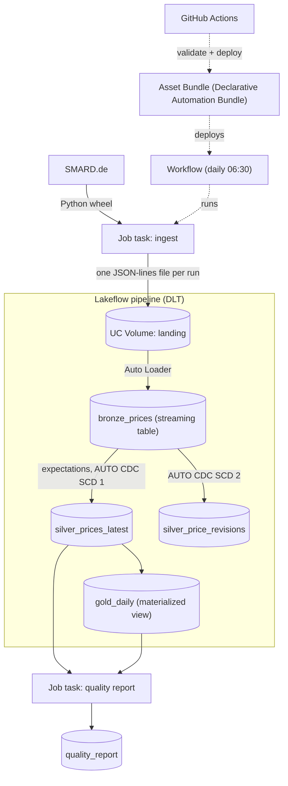

# databricks-energy-quality

[](https://github.com/kaeldrin-gh/databricks-energy-quality/actions/workflows/ci.yml)
[](LICENSE)

This project is a managed lakehouse on **Databricks Free Edition**.

German day-ahead prices arrive as files in a Unity Catalog Volume. A Lakeflow
pipeline (formerly Delta Live Tables) moves them through a bronze, silver and
gold medallion. The pipeline uses Auto Loader, AUTO CDC and quality
expectations. A daily workflow monitors the data and writes a quality report.
If the data is not correct, the workflow fails.

**Stack:** Python · PySpark · Databricks Free Edition (Unity Catalog, Delta Lake, Lakeflow pipelines / DLT, Workflows / Jobs, Asset Bundles) · GitHub Actions

Companion projects:
[de-energy-streaming](https://github.com/kaeldrin-gh/de-energy-streaming)
(self-hosted streaming lakehouse),
[nl-parliament-warehouse](https://github.com/kaeldrin-gh/nl-parliament-warehouse)
(change data capture into BigQuery) and
[nl-energy-warehouse](https://github.com/kaeldrin-gh/nl-energy-warehouse)
(dbt analytics engineering).

## Where to look first

| If you have | Read |
| --- | --- |
| 2 minutes | The architecture and the four screenshots below (the workspace is private, so there is no live link) |
| 10 minutes | [src/notebooks/pipeline.py](src/notebooks/pipeline.py) (Auto Loader bronze, AUTO CDC silver as SCD Type 1 and 2, expectations), then [src/energy_quality/quality.py](src/energy_quality/quality.py) (the checks as pure functions) with [tests/test_quality.py](tests/test_quality.py) |
| The platform side | [databricks.yml](databricks.yml) (dev and prod targets), [resources/](resources/) (schema with grants, Volume, pipeline, three-task job) and [.github/workflows/ci.yml](.github/workflows/ci.yml) (test, validate, deploy, publish) |
| The trade-offs | The Free Edition constraints and known limitations further down |

## Why this project exists

The companion repositories show streaming, change data capture and analytics
engineering on self-hosted and free cloud stacks. This project is intentionally
different. It shows the **managed-platform** side of the work, on a workspace
that costs nothing:

- Unity Catalog and Delta Lake
- Lakeflow pipelines (Delta Live Tables)
- Workflows and Asset Bundles
- CI/CD

Databricks Free Edition needs no credit card, but it has limits. The design of
the project agrees with these limits:

- It uses only serverless compute.
- It stays inside the usage quota.
- It uses one workspace.
- It has one small daily job. There is no bill, so the job cannot make costs.

## Architecture


```mermaid
flowchart TB
    SMARD["SMARD.de"] -->|"Python wheel"| I["Job task: ingest"]
    I -->|"one JSON-lines file per run"| V[("UC Volume: landing")]
    subgraph P["Lakeflow pipeline (DLT)"]
        V -->|Auto Loader| B[("bronze_prices (streaming table)")]
        B -->|"expectations, AUTO CDC SCD 1"| S[("silver_prices_latest")]
        B -->|"AUTO CDC SCD 2"| H[("silver_price_revisions")]
        S --> G[("gold_daily (materialized view)")]
    end
    S --> Q["Job task: quality report"]
    G --> Q
    Q --> R[("quality_report")]
    W["Workflow (daily 06:30)"] -.runs.-> I
    T["Asset Bundle (Declarative Automation Bundle)"] -.deploys.-> W
    C["GitHub Actions"] -.validate + deploy.-> T
```

One Unity Catalog schema contains the landing Volume, a medallion of Delta
tables and the report:

| Object | Contents |
| --- | --- |
| **landing** (Volume) | The raw SMARD batches. Each ingest run writes one JSON-lines file |
| **bronze_prices** | A streaming table with all landed batches. Auto Loader reads them incrementally. Each row keeps the name of its source file |
| **silver_prices_latest** | One row for each `(region, delivery_ts)`. AUTO CDC keeps the newest `fetched_at` (SCD Type 1) |
| **silver_price_revisions** | Each different published price for each hour, with `__START_AT` and `__END_AT` (SCD Type 2). If a new fetch gives the same price, no new version occurs |
| **gold_daily** | A materialized view. For each day: the hours, the average, minimum and maximum price, and the negative hours |
| **quality_report** | One row for each check and run. Each run adds its rows, so you can query the history |

## What it looks like

The daily workflow and the pipeline lineage. These screenshots are older than
the move of bronze into the pipeline (Auto Loader) and of silver to AUTO CDC:


The dashboard after the scheduled run on 3 Oct 2026. All four checks pass.
The charts show 30 days of prices and negative-price hours with no gaps. In
late September, the Free Edition quota stopped some runs. The three-week ingest
window of the next run filled these days:


The quality report from the first run, before the boundary-day fix. The gate
failed visibly. It did not pass with incorrect data:


## What it demonstrates

| Capability | Where |
| --- | --- |
| Unity Catalog | the schema and a managed Volume as bundle resources, with grants as code (read-only for `account users`; only the owner writes) and table and column comments |
| Medallion architecture | bronze (raw batches) → silver (latest price, and every revision) → gold (daily aggregates) |
| Delta Lake | streaming tables, materialized views, report history |
| Lakeflow pipelines (formerly Delta Live Tables) | `src/notebooks/pipeline.py`: Auto Loader, expectations, streaming tables and a materialized view |
| Change data capture | AUTO CDC (formerly `APPLY CHANGES`) into SCD Type 1 and SCD Type 2 tables, sequenced by fetch time |
| Workflows / Jobs | three tasks with dependencies; the SMARD ingest retries twice, 10 min apart |
| Asset Bundles (now Declarative Automation Bundles) | `databricks.yml` + `resources/`, wheel artifact, `dev` (development mode) and `prod` (production mode) targets |
| CI/CD | GitHub Actions: tests always; when a token exists, both targets validated, pull requests deployed to `dev` and `main` to `prod` |
| Data-quality monitoring | freshness, bounds, uniqueness and DST-aware day checks |
| AI/BI dashboards | `src/dashboard.lvdash.json` deployed as a bundle resource |
| Cost awareness | serverless-only config, one small daily job, quota-friendly |

## Free Edition constraints this respects

- **Serverless only.** The project has no cluster configuration. The pipeline
  sets `serverless: true`.
- **Usage quota.** The project has one source and some small tables. One short
  job runs once each day, at 06:30 Europe/Berlin.
- **No account-level APIs.** The bundle uses only workspace-level resources.
  Thus, the grants go to the built-in `account users` group, not to custom
  groups.
- **One workspace.** The `dev` and `prod` targets use the same workspace.
  Development mode keeps them apart:
  - Dev jobs, pipelines and dashboards get the name prefix `[dev <user>]`.
  - The dev schema gets the prefix `dev_<user>_`.
  - The dev schedule is paused.
- **Personal, non-commercial use.** This project is a prototype with open
  documentation.

## The daily job

1. **ingest:** The SMARD client in the wheel gets the recent weekly chunks.
   It writes them as one JSON-lines file to the `landing` Volume. It writes the
   file with a hidden name first and then renames it. Thus, Auto Loader never
   reads an incomplete file. If a fetch fails, the task tries two more times,
   ten minutes apart. Then the run fails.
2. **transform:** The Lakeflow pipeline does these steps:
   - Auto Loader reads the new files into `bronze_prices`.
   - The pipeline removes rows without keys, prices or fetch time.
   - AUTO CDC applies the rows to `silver_prices_latest` and
     `silver_price_revisions`.
   - The pipeline makes `gold_daily` again.
3. **quality:** The task does four checks:
   - Freshness: the SLA is 26 hours.
   - Price bounds: from -500 to 1000 EUR/MWh.
   - Silver uniqueness.
   - Daily hour counts: 23, 24 or 25, because of DST. The first and the last
     day of the rolling window are always incomplete, so the check skips them.

   The task adds the results to `quality_report`. If a check fails, the task
   fails.

The checks are pure functions in `src/energy_quality/quality.py`. Thus, the
unit tests run without a workspace. The other two repositories use the same
pattern for their correctness rules.

The job has no notification channel. When a check fails, the task and the run
fail. The history tile of the dashboard shows the red row. You can query the
evidence in `quality_report`. To add a notification destination later, use the
job settings. You do not have to change the bundle.

## Quickstart (local)

```bash
python -m venv .venv
source .venv/bin/activate     # Windows: .venv\Scripts\activate
pip install -e ".[dev]"

python -m pytest -q           # unit tests, no workspace or network
ruff check . && ruff format --check .
```

## Deploy to your Free Edition workspace

```bash
winget install Databricks.DatabricksCLI    # or brew, or the install script
databricks auth login --host https://<your-workspace>.cloud.databricks.com

pip install build
databricks bundle validate -t dev
databricks bundle deploy -t dev                      # prefixed copies, schedule paused
databricks bundle run -t dev energy_quality_job      # runs the dev job once
databricks bundle deploy -t prod                     # the scheduled job
python scripts/publish_dashboard.py -t prod          # publish the dashboard draft
```

To find your catalog name, run `SHOW CATALOGS` in the SQL editor. If the name
is not `workspace`, give it to the bundle:

```bash
databricks bundle deploy -t dev --var="catalog=<your-catalog>"
```

To let CI deploy for you:

1. Make a workspace token with the **All APIs** scope (Settings -> Developer ->
   Access tokens).
2. Add the repository secrets `DATABRICKS_HOST` and `DATABRICKS_TOKEN`.

After this, CI does these steps:

- Each run validates the `dev` and `prod` targets.
- Each pull request deploys to `dev`.
- Each push to `main` and each manual `workflow_dispatch` run deploys to
  `prod` and publishes the dashboard.

The workflow hides the workspace user path, the email and the workspace host in
its logs. Thus, the public Actions tab shows no personal details. If the
secrets are not set, CI stays green. It skips the validation and the deploy and
shows a notice.

## Dashboard

`src/dashboard.lvdash.json` is the dashboard **as code**. It contains:

- counters: checks passed, hours ahead, negative hours and average price
- the latest check results and the check history
- a price chart and a negative-hours chart

The dashboard deploys with the bundle. A variable lookup finds the SQL
warehouse by name (`warehouse_id` in `databricks.yml`). Thus, the repository
contains no workspace-specific ID. `sql/quality_queries.sql` has the same
queries for ad-hoc use.

The queries do not include a catalog or a schema in the table names. The
bundle sets the default catalog and schema of the dashboard for each target.
Thus, the dev dashboard reads the dev tables.

A bundle deploy updates only the dashboard *draft*. After each deploy, run
`python scripts/publish_dashboard.py -t prod` (or `make publish TARGET=prod`).
Then viewers see the new version.

## Known limitations

- **This project is a prototype on Databricks Free Edition** (personal use).
  It is not a production deployment.
  - The free tier has a fair-usage quota. When a workspace goes above it,
    Databricks stops the compute for the rest of the day, and sometimes
    longer. Then a scheduled run does not start.
  - The pipeline can recover from this. The ingest window is three weekly
    chunks, and silver keeps the newest revision. Thus, the next successful
    run fills the gap without a manual backfill.
  - In late September 2026, the compute stayed off for eight days. The first
    run after that restored all missing hours.
- **The workspace is private.** Thus, there is no public live link. Reviewers
  can get a free Free Edition account and deploy the bundle themselves.
- **The first deploy on a new workspace can need serverless changes.** The
  bundle contains the three changes that this repository needed:
  - Serverless job tasks do not accept task-level `libraries`. The wheel goes
    into the job environment.
  - That environment must have an `environment_version`.
  - Paths in `environments[].spec.dependencies` start at the resource file
    (`../dist/*.whl`), not at the bundle root.

  Serverless environments can also keep an old wheel with the same version in
  their cache. Thus, the project increases the version each time the package
  changes.
- **The move of bronze into the pipeline needed a migration.**
  - The old bronze table stays as `bronze_prices_legacy`. A one-time export
    copied its rows into the landing Volume. Thus, the pipeline has the full
    revision history.
  - A materialized view cannot change into a streaming table in place. Thus,
    the AUTO CDC output has a new name, `silver_prices_latest`. The old
    `silver_prices` view does not get updates now.
- **The `prod` target continues an older target.** The first deployments used
  one target with the name `free`.
  - The `prod` target uses the workspace path of `free`. Thus, its deployment
    state still contains the job and the pipeline.
  - The schema existed before the bundle managed it.
    `databricks bundle deployment bind` connected it to the bundle.
  - The bundle now manages the schema. Thus, `databricks bundle destroy -t prod`
    tries to delete the schema and all its tables. The CLI asks for
    confirmation before it deletes a schema.

## Layout

```
databricks.yml                       bundle definition (variables, wheel, dev and prod targets)
resources/                           schema, volume, pipeline, job and dashboard resources
src/energy_quality/                  package: SMARD client, quality checks, tasks
src/notebooks/                       Databricks notebooks (ingest, pipeline, report)
src/dashboard.lvdash.json            dashboard definition (deployed as code)
scripts/publish_dashboard.py         publishes the deployed dashboard draft
tests/                               unit tests for parsers, landing files and quality rules
sql/                                 dashboard queries
.github/workflows/ci.yml             tests + conditional bundle validate/deploy
```

## License

MIT, see [LICENSE](LICENSE). Data © Bundesnetzagentur / SMARD.de (DL-DE/BY-2.0).
