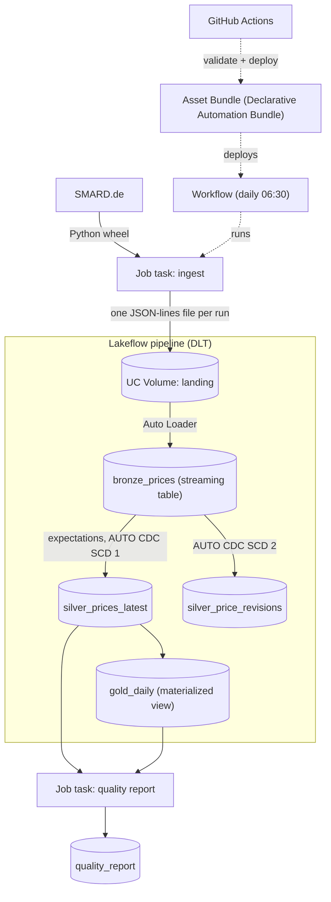
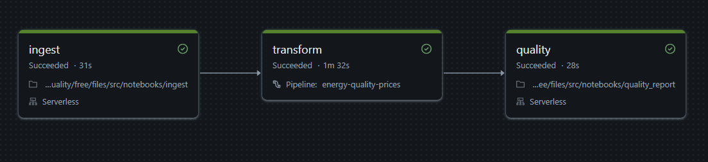
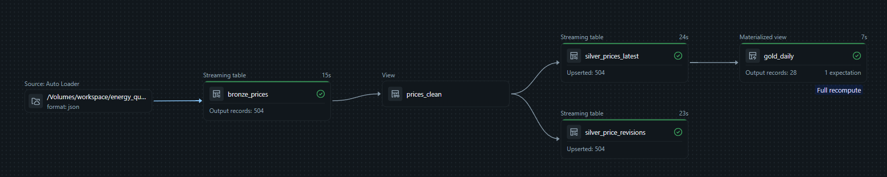
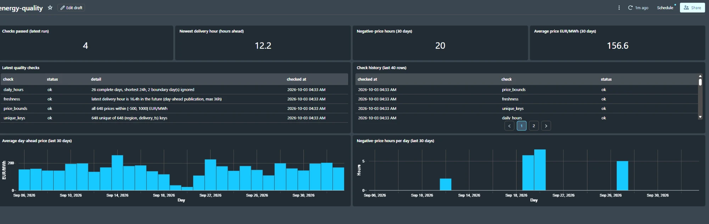
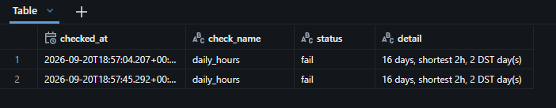

# databricks-energy-quality

[](https://github.com/kaeldrin-gh/databricks-energy-quality/actions/workflows/ci.yml)
[](LICENSE)

A managed-lakehouse data-engineering project on **Databricks Free Edition**:
German day-ahead prices land as files in a Unity Catalog Volume, flow through a
bronze/silver/gold medallion in a Lakeflow pipeline (formerly Delta Live
Tables) with Auto Loader, AUTO CDC and quality expectations, and are monitored
by a daily workflow that writes a quality report and fails when the data stops
being trustworthy.

**Stack:** Python · PySpark · Databricks Free Edition (Unity Catalog, Delta Lake, Lakeflow pipelines / DLT, Workflows / Jobs, Asset Bundles) · GitHub Actions

Companion projects:
[de-energy-streaming](https://github.com/kaeldrin-gh/de-energy-streaming)
(self-hosted streaming lakehouse),
[nl-parliament-warehouse](https://github.com/kaeldrin-gh/nl-parliament-warehouse)
(change data capture into BigQuery) and
[nl-energy-warehouse](https://github.com/kaeldrin-gh/nl-energy-warehouse)
(dbt analytics engineering).

## Where to look first

| If you have | Read |
| --- | --- |
| 2 minutes | The architecture and the four screenshots below (the workspace is private, so there is no live link) |
| 10 minutes | [src/notebooks/pipeline.py](src/notebooks/pipeline.py) (Auto Loader bronze, AUTO CDC silver as SCD Type 1 and 2, expectations), then [src/energy_quality/quality.py](src/energy_quality/quality.py) (the checks as pure functions) with [tests/test_quality.py](tests/test_quality.py) |
| The platform side | [databricks.yml](databricks.yml) and [resources/job.yml](resources/job.yml) (the bundle and the three-task job) and [.github/workflows/ci.yml](.github/workflows/ci.yml) (test, validate, deploy, publish) |
| The trade-offs | The Free Edition constraints and known limitations further down |

## Why this project exists

The companion repositories prove streaming, change data capture and analytics
engineering on self-hosted and free cloud stacks. This one is deliberately
different: it shows the **managed-platform** side of the job - Unity Catalog,
Delta Lake, Lakeflow pipelines (Delta Live Tables), Workflows, Asset Bundles
and CI/CD - on a workspace that costs nothing.

Databricks Free Edition needs no credit card, but it is constrained, and the
project is built around those constraints on purpose:
serverless compute only, quota limits, one workspace, and a single small daily
job that cannot run up a bill that does not exist.

## Architecture


```mermaid
flowchart TB
    SMARD["SMARD.de"] -->|"Python wheel"| I["Job task: ingest"]
    I -->|"one JSON-lines file per run"| V[("UC Volume: landing")]
    subgraph P["Lakeflow pipeline (DLT)"]
        V -->|Auto Loader| B[("bronze_prices (streaming table)")]
        B -->|"expectations, AUTO CDC SCD 1"| S[("silver_prices_latest")]
        B -->|"AUTO CDC SCD 2"| H[("silver_price_revisions")]
        S --> G[("gold_daily (materialized view)")]
    end
    S --> Q["Job task: quality report"]
    G --> Q
    Q --> R[("quality_report")]
    W["Workflow (daily 06:30)"] -.runs.-> I
    T["Asset Bundle (Declarative Automation Bundle)"] -.deploys.-> W
    C["GitHub Actions"] -.validate + deploy.-> T
```

One Unity Catalog schema holds the landing Volume, a medallion of Delta tables
and the report:

- **landing** (Volume) - raw SMARD batches, one JSON-lines file per ingest run
- **bronze_prices** - streaming table: every landed batch, read incrementally by
  Auto Loader, with the source file of each row
- **silver_prices_latest** - one row per `(region, delivery_ts)`: AUTO CDC keeps
  the newest `fetched_at` (SCD Type 1)
- **silver_price_revisions** - every distinct published price per hour with
  `__START_AT` and `__END_AT` (SCD Type 2); a refetch of the same price adds no
  version
- **gold_daily** - materialized view: hours, average/min/max price and negative
  hours per day
- **quality_report** - every check run, appended so history is queryable

## What it looks like

The daily workflow and the pipeline lineage (captured before bronze moved into
the pipeline with Auto Loader and silver to AUTO CDC):





The dashboard - counters, latest checks, check history, prices and negative-price
hours - and the quality report the first run wrote before the boundary-day fix
(the gate failing loudly instead of passing silently):





## What it demonstrates

| Capability | Where |
| --- | --- |
| Unity Catalog | a managed Volume for raw files and `catalog.schema.table` naming, both as bundle resources and variables |
| Medallion architecture | bronze (raw batches) → silver (latest price, and every revision) → gold (daily aggregates) |
| Delta Lake | streaming tables, materialized views, report history |
| Lakeflow pipelines (formerly Delta Live Tables) | `src/notebooks/pipeline.py`: Auto Loader, expectations, streaming tables and a materialized view |
| Change data capture | AUTO CDC (formerly `APPLY CHANGES`) into SCD Type 1 and SCD Type 2 tables, sequenced by fetch time |
| Workflows / Jobs | three tasks with dependencies; the SMARD ingest retries twice, 10 min apart |
| Asset Bundles (now Declarative Automation Bundles) | `databricks.yml` + `resources/`, wheel artifact |
| CI/CD | GitHub Actions: tests always, bundle validate + deploy when a token exists |
| Data-quality monitoring | freshness, bounds, uniqueness and DST-aware day checks |
| AI/BI dashboards | `src/dashboard.lvdash.json` deployed as a bundle resource |
| Cost awareness | serverless-only config, one small daily job, quota-friendly |

## Free Edition constraints this respects

- **Serverless only** - no cluster configuration anywhere; the pipeline sets
  `serverless: true`.
- **Quota-limited** - one source, a few small tables, one short daily job that runs
  once a day at 06:30 Europe/Berlin.
- **No account-level APIs** - the bundle uses workspace-level resources only.
- **Personal, non-commercial use** - this is an openly documented prototype.

## The daily job

1. **ingest** - the wheel's SMARD client fetches the recent weekly chunks and
   writes them as one JSON-lines file to the `landing` Volume (under a hidden
   name first, then renamed, so Auto Loader never reads a half-written file). A
   failed fetch is retried twice, ten minutes apart, before the run fails.
2. **transform** - the Lakeflow pipeline reads new files into `bronze_prices`
   with Auto Loader, drops rows missing keys, prices or fetch time, applies
   them with AUTO CDC to `silver_prices_latest` and `silver_price_revisions`,
   and rebuilds `gold_daily`.
3. **quality** - freshness (26 h SLA), price bounds (-500..1000 EUR/MWh),
   silver uniqueness and daily hour counts (23/24/25, DST-aware; the first and
   last day of the rolling window are partial by construction and skipped) are
   checked, appended to `quality_report`, and any failure fails the task.

The checks live in `src/energy_quality/quality.py` as pure functions, so they
are unit-tested without a workspace - the same pattern the other two
repositories use for their correctness rules.

No notification channel is configured: a failing check fails the task and the
run, the dashboard's history tile shows the red row, and `quality_report` keeps
the evidence queryable. A notification destination can be added in the job's
settings later without touching the bundle.

## Quickstart (local)

```bash
python -m venv .venv
source .venv/bin/activate     # Windows: .venv\Scripts\activate
pip install -e ".[dev]"

python -m pytest -q           # unit tests, no workspace or network
ruff check . && ruff format --check .
```

## Deploy to your Free Edition workspace

```bash
winget install Databricks.DatabricksCLI    # or brew, or the install script
databricks auth login --host https://<your-workspace>.cloud.databricks.com

pip install build
databricks bundle validate -t free
databricks bundle deploy -t free
python scripts/publish_dashboard.py -t free          # publish the dashboard draft
databricks bundle run -t free energy_quality_job    # runs the job once
```

Find your catalog name with `SHOW CATALOGS` in the SQL editor and pass it to
the bundle if it is not `workspace`:

```bash
databricks bundle deploy -t free --var="catalog=<your-catalog>"
```

To let CI deploy for you, create a workspace token (Settings -> Developer ->
Access tokens) with the **All APIs** scope, then add the repository secrets
`DATABRICKS_HOST` and `DATABRICKS_TOKEN`. Pushes to `main` and manual
`workflow_dispatch` runs then validate, deploy and publish the dashboard. The
workflow masks the workspace user path, the email and the workspace host in its
logs, so the public Actions tab stays free of personal details. Without the
secrets, CI stays green and skips validation and deploy with a notice.

## Dashboard

`src/dashboard.lvdash.json` is the dashboard **as code**: counters (checks
passed, hours ahead, negative hours, average price), the latest check results,
the check history, and price and negative-hours charts. It deploys with the
bundle, and the SQL warehouse is resolved by name through a variable lookup
(`warehouse_id` in `databricks.yml`), so no workspace-specific ID is committed.
`sql/quality_queries.sql` has the same queries for ad-hoc use.

Bundle deploys update the dashboard *draft*; run
`python scripts/publish_dashboard.py -t free` (or `make publish`) after a deploy
so viewers see the new revision.

## Known limitations

- This is a **prototype on Databricks Free Edition** (personal use), not a
  production deployment. The free tier enforces a fair-usage quota: when it is
  exceeded, compute is disabled for the rest of the day (occasionally longer),
  so a scheduled run can be skipped. The pipeline is built for that - the
  ingest window is three weekly chunks and silver keeps the newest revision, so
  the next successful run recovers the gap without a manual backfill. In
  late September 2026 compute stayed disabled for eight days; the first run
  afterwards restored every missing hour.
- The workspace is private, so there is no public live link - reviewers can
  sign up for Free Edition (free) and deploy the bundle themselves.
- First deploys on a fresh workspace can surface serverless-specific tweaks,
  and the bundle now encodes the three this repository hit: serverless job
  tasks reject task-level `libraries` (the wheel belongs in the job
  environment), that environment requires an `environment_version`, and paths
  in `environments[].spec.dependencies` resolve relative to the resource file
  (`../dist/*.whl`), not the bundle root. Serverless environments can also
  keep a cached wheel with the same version, so the version is bumped whenever
  the package changes.
- Moving bronze into the pipeline needed a migration. The earlier bronze table
  is kept as `bronze_prices_legacy`, and its rows were exported once into the
  landing Volume, so the pipeline holds the full revision history. A
  materialized view cannot become a streaming table in place, so the AUTO CDC
  output got a new name, `silver_prices_latest`; the old `silver_prices` view is
  no longer updated.

## Layout

```
databricks.yml                       bundle definition (variables, wheel, target)
resources/                           volume, pipeline, job and dashboard resources
src/energy_quality/                  package: SMARD client, quality checks, tasks
src/notebooks/                       Databricks notebooks (ingest, pipeline, report)
src/dashboard.lvdash.json            dashboard definition (deployed as code)
scripts/publish_dashboard.py         publishes the deployed dashboard draft
tests/                               unit tests for parsers, landing files and quality rules
sql/                                 dashboard queries
.github/workflows/ci.yml             tests + conditional bundle validate/deploy
```

## License

MIT, see [LICENSE](LICENSE). Data © Bundesnetzagentur / SMARD.de (DL-DE/BY-2.0).
